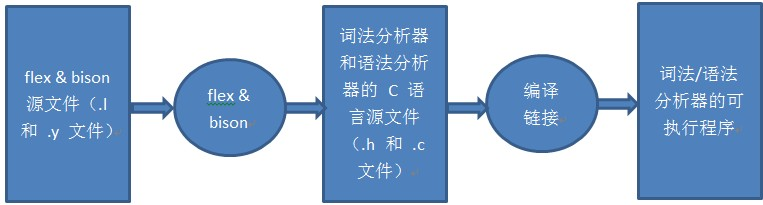

# Flex词法分析器生成器

## 本仓库内容

* Flex学习笔记


```
Something I hope you know before go into the coding~
First, please watch or star this repo, I'll be more happy if you follow me.
Bug report, questions and discussion are welcome, you can post an issue or pull a request.
相关站点
```

## 相关站点

* Flex仓库：<https://github.com/westes/flex>

## Flex简介

Flex，前身是lex，lex是1975年由Mike Lesk和当时尚在AT&T实习的Eric Schmidt共同完成的基于UNIX环境的词法分析器的生成工具。这个lex很有名气，但是无奈效率太低加上有bug，让人用的很不爽。后来伯克利实验室的Vern Paxson用C重新写了lex，并命名为flex（Fast Lexical Analyzer Generator）。

**The Fast Lexical Analyzer - scanner generator for lexing in C and C++**

Flex is a fast lexical analyser generator. It is a tool for generating programs that perform pattern-matching on text. Flex is a free (but non-GNU) implementation of the original Unix lex program.

The project repository is now hosted at github: https://github.com/westes/flex.
Releases can be found at https://github.com/westes/flex/releases.

Flex是一个用C语言编写的词法(Lexer)分析工具，Bison是语法(Parser)分析工具，他们是Lex&Yacc的GNU代替品。


## 思维导图




## 参考

CSDN:<https://blog.csdn.net/youngtiger86/article/details/7578175>


## 总结
